# Spec Kit 架构设计文档

## 1. 核心设计思想

### 1.1 规范驱动开发（SDD）的权力倒置

Spec Kit 基于规范驱动开发（Specification-Driven Development，SDD）理念，这是一种对传统软件开发模式的根本性颠覆：

- **传统开发模式**：代码是王道，规范是脚手架，完成编码后就被丢弃
- **SDD 模式**：规范是王道，代码服务于规范，规范直接生成实现

这种权力倒置消除了规范与实现之间的差距，使规范成为可执行的源文件，直接生成工作实现，而不仅仅是指导实现。

### 1.2 意图驱动开发

SDD 强调意图驱动开发（Intent-Driven Development）：
- 开发团队的意图用自然语言表达
- 设计资产、核心原则和其他指南作为补充
- 代码成为规范的表达，是最后一公里的实现
- 维护软件意味着演进规范，而不是直接修改代码

### 1.3 模板驱动的质量控制

Spec Kit 使用结构化模板约束 AI 行为，确保生成高质量的规范和实现：
- 防止过早引入实现细节
- 强制标记不确定性
- 通过清单实现结构化思考
- 强制执行架构原则
- 维护适当的抽象级别
- 鼓励测试优先思维
- 防止添加投机性功能

### 1.4 宪法驱动的架构纪律

Spec Kit 引入了"开发宪法"概念，定义了不可变的开发原则：
- 库优先原则：每个功能必须首先作为独立库实现
- CLI 接口强制：每个库必须通过命令行接口暴露功能
- 测试优先 imperative：无测试不编码
- 简单性和反抽象原则：避免过度工程
- 集成优先测试：优先使用真实环境测试

## 2. 总体架构设计

Spec Kit 采用分层模块化架构，围绕 CLI 工具展开，分为三个主要层级：用户交互层、核心功能层和基础设施层。每个层级包含特定的模块，模块间通过定义明确的接口进行交互。

### 2.1 架构分层

| 层级           | 主要职责                         | 核心模块                                                                 |
| -------------- | -------------------------------- | ------------------------------------------------------------------------ |
| **用户交互层** | 处理用户输入和输出，提供交互界面 | CLI 命令行界面、/speckit.* 命令                                          |
| **核心功能层** | 实现规范驱动开发的核心逻辑       | 模板管理系统、规范生成引擎、计划生成引擎、任务生成引擎、实现执行引擎     |
| **基础设施层** | 提供底层支持和外部集成           | GitHub 模板仓库、AI 代理集成、Git 版本控制、跨平台脚本支持、环境变量管理 |

### 2.2 模块间交互关系

1. **用户交互层**：
   - CLI 命令行界面接收用户输入，调用核心功能层的模块
   - /speckit.* 命令由 AI 代理调用，触发核心功能层的工作流自动化

2. **核心功能层**：
   - 模板管理系统为规范生成、计划生成和任务生成提供模板支持
   - 工作流自动化模块协调规范生成、计划生成、任务生成和实现执行的流程
   - 规范生成引擎生成结构化规范文档
   - 计划生成引擎将规范转换为技术实现计划
   - 任务生成引擎将技术计划分解为可执行任务列表
   - 实现执行引擎执行任务，生成最终实现

3. **基础设施层**：
   - GitHub 模板仓库提供模板存储和版本控制
   - AI 代理集成支持多种 AI 代理
   - Git 版本控制管理项目代码和文档
   - 跨平台脚本支持确保在不同操作系统上的兼容性
   - 环境变量管理处理配置和环境相关的设置

### 2.3 架构图

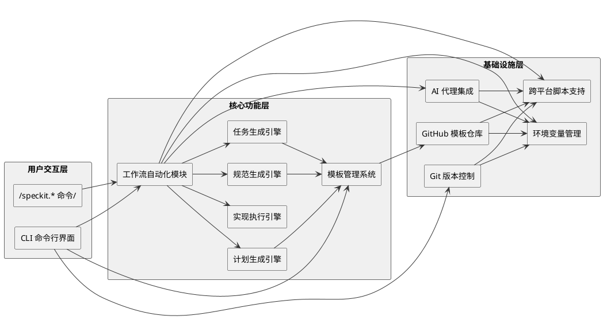

### 2.4 架构特点

1. **模块化设计**：清晰的组件划分，便于维护和扩展
2. **分层架构**：各层级职责明确，耦合度低
3. **跨平台支持**：支持 Linux、macOS 和 Windows
4. **多 AI 代理兼容**：支持多种 AI 代理，适应不同开发者偏好
5. **模板驱动**：使用模板确保输出一致性和质量
6. **自动化工作流**：通过命令自动化规范驱动开发流程
7. **可扩展架构**：易于添加新的 AI 代理和功能
8. **清晰的依赖关系**：模块间依赖关系明确，便于理解和维护

## 3. 模块组成

### 3.0 模块目录结构

Spec Kit 采用清晰的模块化目录结构，各模块按照功能和职责组织在不同的目录中。以下是项目的主要目录结构：

```
spec-kit/
├── src/
│   └── specify_cli/          # CLI 模块的核心代码
│       └── __init__.py       # CLI 应用的主入口文件
├── templates/                # 模板管理模块的模板文件
│   ├── commands/             # AI 命令模板
│   └── *.md                  # 各种模板文件（计划、规范、任务等）
├── scripts/                  # 工作流自动化模块的脚本
│   ├── bash/                 # Bash 脚本
│   └── powershell/           # PowerShell 脚本
├── docs/                     # 项目文档
│   └── architecture/         # 架构文档
├── media/                    # 媒体资源
├── memory/                   # 记忆存储
├── .devcontainer/            # 开发容器配置
├── .github/                  # GitHub 配置
├── pyproject.toml            # Python 项目配置
└── README.md                 # 项目说明文档
```

### 3.1 CLI 模块

**功能**：处理命令行输入和输出，提供用户与系统交互的入口

**入口文件**：`src/specify_cli/__init__.py` - CLI 应用的主入口，使用 Typer 框架构建

**主要组件**：
- 命令解析器：使用 Typer 库解析命令行参数和选项
- 命令处理器：处理 init、check、version 等命令
- 输出格式化器：使用 Rich 库提供富文本输出

**关键功能**：
- 项目初始化：`specify init`
- 工具检查：`specify check`
- 版本信息：`specify version`

**启动方式**：
- 安装后直接运行：`specify <command>`
- 开发模式：`python src/specify_cli/__init__.py <command>`

**内部架构与数据流**：

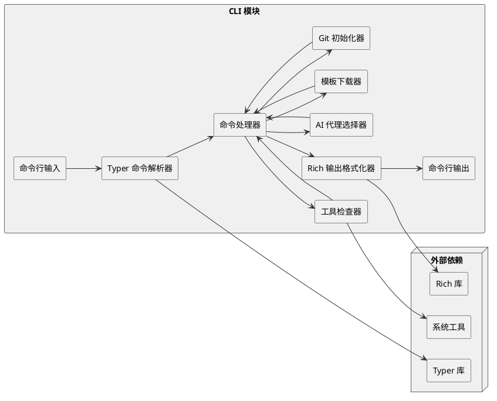

**数据流说明**：
1. 用户通过命令行输入命令和参数
2. Typer 命令解析器解析输入，识别命令和选项
3. 命令处理器根据解析结果调用相应的功能模块
4. 功能模块执行具体操作：
   - 工具检查器检查系统工具是否安装
   - AI 代理选择器处理 AI 代理的选择
   - 模板下载器从 GitHub 下载模板
   - Git 初始化器初始化 Git 仓库
5. 命令处理器将执行结果传递给输出格式化器
6. Rich 输出格式化器将结果格式化为富文本
7. 最终结果通过命令行输出展示给用户
8. CLI 模块依赖外部库（Typer、Rich）和系统工具

### 3.2 模板管理模块

**功能**：管理模板的下载、提取和定制

**入口文件**：`src/specify_cli/__init__.py` - 模板管理功能集成在 CLI 模块中

**主要组件**：
- 模板下载器：从 GitHub API 获取最新模板
- 模板提取器：提取和处理模板文件
- 模板定制器：根据用户选择定制模板

**关键功能**：
- 从 GitHub 下载最新模板
- 支持不同 AI 代理和脚本类型
- 处理模板合并和覆盖

**模板存储位置**：
- 本地模板：`templates/` 目录
- 远程模板：GitHub 模板仓库（https://github.com/github/spec-kit）

**调用入口**：
- `download_template_from_github()` 函数：从 GitHub 下载模板
- `download_and_extract_template()` 函数：下载并提取模板到项目目录

**内部架构与数据流**：

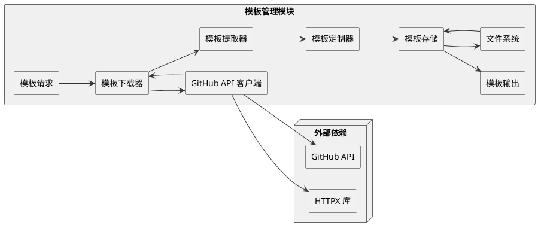

**数据流说明**：
1. 系统或用户发起模板请求，指定所需的模板类型和版本
2. 模板下载器接收请求，调用 GitHub API 客户端
3. GitHub API 客户端使用 HTTPX 库向 GitHub API 发送请求
4. GitHub API 返回模板文件（ZIP 格式）
5. 模板下载器将下载的模板传递给模板提取器
6. 模板提取器解压并提取模板文件
7. 模板定制器根据用户选择（如 AI 代理类型、脚本类型）定制模板
8. 定制后的模板存储到模板存储中
9. 模板存储将模板输出到指定位置
10. 模板存储与文件系统交互，读取和写入模板文件
11. 最终输出定制后的模板文件供其他模块使用

**关键流程**：
- 模板下载：从 GitHub 仓库获取最新模板
- 模板提取：解压和处理下载的模板文件
- 模板定制：根据用户选择调整模板内容
- 模板存储：管理模板的本地存储和访问
- 模板输出：将定制后的模板输出到项目目录

### 3.3 项目初始化模块

**功能**：初始化新项目，设置目录结构和基本配置

**入口文件**：`src/specify_cli/__init__.py` - 项目初始化功能通过 CLI 的 `init` 命令实现

**主要组件**：
- 工具检查器：检查 Git 等必要工具是否安装
- AI 代理选择器：交互式选择或直接指定 AI 代理
- 目录结构生成器：创建项目目录结构
- Git 初始化器：初始化 Git 仓库

**关键功能**：
- 检查系统依赖
- 选择 AI 代理
- 下载和提取模板
- 初始化 Git 仓库
- 设置文件权限

**调用入口**：
- `init()` 函数：处理项目初始化命令
- `check_tool()` 函数：检查必要工具是否安装
- `init_git_repo()` 函数：初始化 Git 仓库
- `ensure_executable_scripts()` 函数：确保脚本可执行

**内部架构与数据流**：

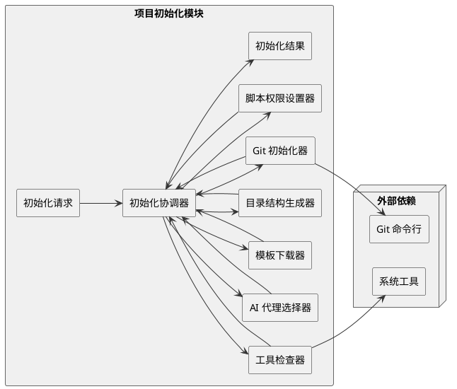

**数据流说明**：
1. 用户或系统发起项目初始化请求，指定项目名称和选项
2. 初始化协调器接收请求，协调各个组件的工作
3. 工具检查器检查系统是否安装了必要的工具（如 Git）
4. AI 代理选择器处理 AI 代理的选择（交互式或命令行指定）
5. 模板下载器从 GitHub 下载适合的模板
6. 目录结构生成器创建项目的目录结构
7. Git 初始化器初始化 Git 仓库
8. 脚本权限设置器确保脚本文件具有可执行权限
9. 各个组件将执行结果返回给初始化协调器
10. 初始化协调器汇总结果，生成最终的初始化结果
11. 初始化结果返回给用户或系统

**关键流程**：
- 工具检查：确保系统具备必要的工具
- AI 代理配置：根据用户选择配置 AI 代理
- 模板应用：下载并应用适合的模板
- 项目结构创建：生成标准的项目目录结构
- Git 初始化：为项目创建 Git 仓库
- 权限设置：确保脚本文件可执行

### 3.4 AI 代理集成模块

**功能**：支持多种 AI 代理，提供统一的集成接口

**入口文件**：`src/specify_cli/__init__.py` - AI 代理配置在 `AGENT_CONFIG` 字典中定义

**主要组件**：
- 代理配置管理器：管理不同 AI 代理的配置
- 代理能力检测器：检测 AI 代理的能力和限制
- 代理命令生成器：生成适合不同 AI 代理的命令

**关键功能**：
- 支持 16 种 AI 代理
- 自动检测 AI 代理安装情况
- 生成代理特定的命令文件
- 处理不同代理的命令格式

**代理配置**：
- 配置位置：`AGENT_CONFIG` 字典
- 支持的代理：copilot、claude、gemini、cursor-agent、qwen、opencode、codex 等
- 每个代理配置包含：名称、文件夹、安装 URL 和 CLI 要求

**调用入口**：
- `check_tool()` 函数：检查 AI 代理是否安装
- `select_with_arrows()` 函数：交互式选择 AI 代理

**内部架构与数据流**：

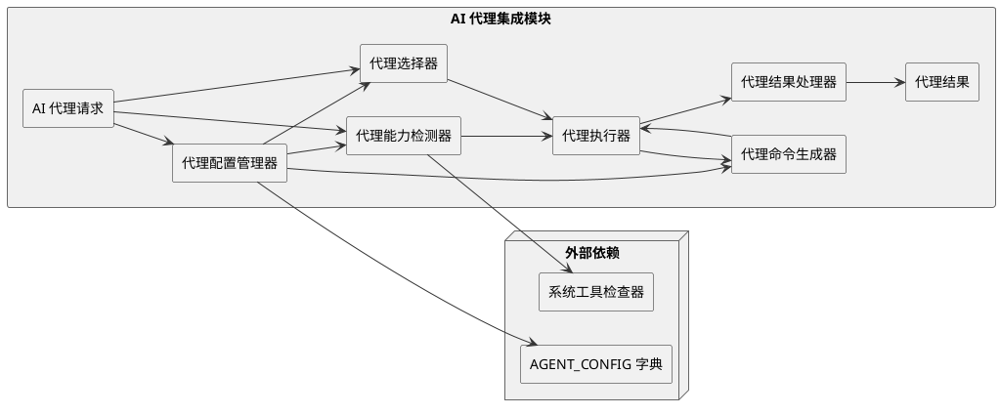

**数据流说明**：
1. 系统或用户发起 AI 代理请求，指定所需的代理操作
2. 代理配置管理器从 AGENT_CONFIG 字典中获取代理配置
3. 代理能力检测器检查 AI 代理是否安装及其能力
4. 代理选择器根据用户选择或自动检测选择合适的 AI 代理
5. 代理命令生成器根据代理类型生成特定的命令
6. 代理执行器执行生成的命令
7. 代理结果处理器处理执行结果
8. 最终结果返回给用户或系统

**关键流程**：
- 代理配置加载：从 AGENT_CONFIG 字典加载代理配置
- 代理能力检测：检查 AI 代理是否安装及其能力
- 代理选择：根据用户选择或自动检测选择合适的 AI 代理
- 命令生成：生成适合特定 AI 代理的命令
- 命令执行：执行生成的命令
- 结果处理：处理和返回执行结果

**支持的 AI 代理**：
- copilot (GitHub Copilot)
- claude (Claude Code)
- gemini (Gemini CLI)
- cursor-agent (Cursor)
- qwen (Qwen Code)
- opencode (opencode)
- codex (Codex CLI)
- windsurf (Windsurf)
- kilocode (Kilo Code)
- auggie (Auggie CLI)
- codebuddy (CodeBuddy)
- roo (Roo Code)
- q (Amazon Q Developer CLI)
- amp (Amp)
- shai (SHAI)
- bob (IBM Bob)

### 3.5 工作流自动化模块

**功能**：实现 /speckit.* 命令，自动化规范驱动开发流程

**主要组件**：
- 命令处理器：处理 /speckit.* 命令
- 工作流协调器：协调不同阶段的工作流
- 文档生成器：生成各种文档

**关键命令**：
- `/speckit.constitution`：创建项目原则
- `/speckit.specify`：创建规范
- `/speckit.plan`：生成技术实现计划
- `/speckit.tasks`：生成任务列表
- `/speckit.implement`：执行实现
- `/speckit.clarify`：澄清规范
- `/speckit.analyze`：分析跨工件一致性
- `/speckit.checklist`：生成质量检查清单

**脚本位置**：
- Bash 脚本：`scripts/bash/` 目录
- PowerShell 脚本：`scripts/powershell/` 目录

**模板位置**：
- AI 命令模板：`templates/commands/` 目录

**调用入口**：
- 由 AI 代理直接调用 `/speckit.*` 命令
- 脚本通过模板生成具体的实现内容

**内部架构与数据流**：

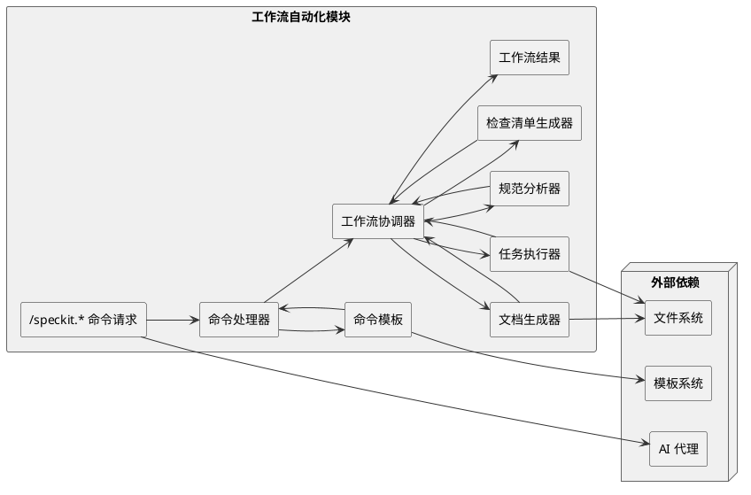

**数据流说明**：
1. AI 代理发起 `/speckit.*` 命令请求
2. 命令处理器接收命令，解析命令类型
3. 命令处理器从命令模板中获取相应的模板
4. 工作流协调器根据命令类型协调各个组件的工作
5. 根据命令类型调用不同的组件：
   - 文档生成器：生成项目原则、规范、技术计划等文档
   - 任务执行器：执行实现任务
   - 规范分析器：分析跨工件一致性
   - 检查清单生成器：生成质量检查清单
6. 各个组件将执行结果返回给工作流协调器
7. 工作流协调器汇总结果，生成最终的工作流结果
8. 结果返回给 AI 代理或用户

**关键流程**：
- 命令解析：解析 `/speckit.*` 命令，识别命令类型
- 模板应用：根据命令类型应用相应的模板
- 工作流协调：协调不同组件的执行顺序和依赖关系
- 文档生成：生成各种规范和计划文档
- 任务执行：执行实现任务
- 结果处理：处理和返回执行结果

**支持的工作流**：
1. 项目原则创建：`/speckit.constitution`
2. 规范创建：`/speckit.specify`
3. 技术计划生成：`/speckit.plan`
4. 任务列表生成：`/speckit.tasks`
5. 实现执行：`/speckit.implement`
6. 规范澄清：`/speckit.clarify`
7. 跨工件分析：`/speckit.analyze`
8. 质量检查：`/speckit.checklist`

### 3.6 规范生成模块

**功能**：生成结构化的规范文档

**入口文件**：`templates/spec-template.md` - 规范生成的模板文件

**主要组件**：
- 规范模板管理器：管理规范模板
- 规范内容生成器：生成规范内容
- 规范验证器：验证规范的完整性和一致性

**关键功能**：
- 生成用户故事
- 定义功能要求
- 制定验收标准
- 标记不确定性
- 验证规范质量

**调用入口**：
- 通过 AI 代理调用 `/speckit.specify` 命令
- 使用 `templates/spec-template.md` 模板生成规范文档

**输出位置**：
- 生成的规范文档存储在项目根目录下

**内部架构与数据流**：

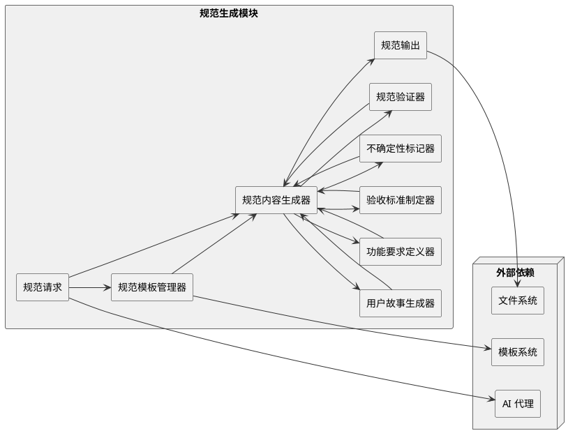

**数据流说明**：
1. AI 代理发起规范生成请求，提供需求描述
2. 规范模板管理器从模板系统中获取规范模板
3. 规范内容生成器接收请求和模板，生成规范内容
4. 规范内容生成器调用各个子组件：
   - 用户故事生成器：生成用户故事
   - 功能要求定义器：定义功能要求
   - 验收标准制定器：制定验收标准
   - 不确定性标记器：标记不确定性
5. 各个子组件将生成的内容返回给规范内容生成器
6. 规范内容生成器将生成的规范传递给规范验证器
7. 规范验证器验证规范的完整性和一致性
8. 验证结果返回给规范内容生成器，如有问题则进行修正
9. 最终生成的规范输出到文件系统

**关键流程**：
- 模板加载：从模板系统加载规范模板
- 内容生成：生成用户故事、功能要求、验收标准等内容
- 不确定性标记：标记规范中的不确定性
- 规范验证：验证规范的完整性和一致性
- 规范输出：将生成的规范输出到文件系统

**规范结构**：
1. 项目概述
2. 用户故事
3. 功能要求
4. 验收标准
5. 不确定性标记
6. 质量检查清单

### 3.7 计划生成模块

**功能**：将规范转换为技术实现计划

**入口文件**：`templates/plan-template.md` - 计划生成的模板文件

**主要组件**：
- 规范分析器：分析规范内容
- 技术栈选择器：选择适合的技术栈
- 架构设计器：设计系统架构
- 数据模型生成器：生成数据模型

**关键功能**：
- 分析规范要求
- 确保与项目宪法一致
- 转换为技术架构
- 生成支持文档（数据模型、API 契约等）
- 生成快速入门指南

**调用入口**：
- 通过 AI 代理调用 `/speckit.plan` 命令
- 使用 `templates/plan-template.md` 模板生成技术实现计划

**输出位置**：
- 生成的计划文档存储在项目根目录下

**内部架构与数据流**：

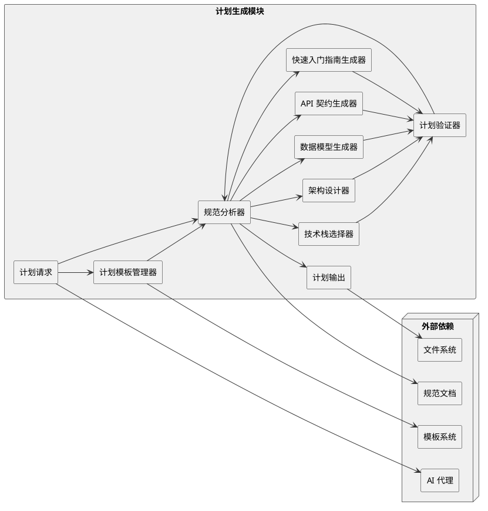

**数据流说明**：
1. AI 代理发起计划生成请求，指定规范文档
2. 计划模板管理器从模板系统中获取计划模板
3. 规范分析器分析规范文档，提取关键信息
4. 规范分析器调用各个子组件：
   - 技术栈选择器：选择适合的技术栈
   - 架构设计器：设计系统架构
   - 数据模型生成器：生成数据模型
   - API 契约生成器：生成 API 契约
   - 快速入门指南生成器：生成快速入门指南
5. 各个子组件将生成的内容返回给规范分析器
6. 计划验证器验证计划的完整性和一致性
7. 验证结果返回给规范分析器，如有问题则进行修正
8. 最终生成的计划输出到文件系统

**关键流程**：
- 规范分析：分析规范文档，提取关键信息
- 技术栈选择：根据规范要求选择适合的技术栈
- 架构设计：设计系统架构，包括模块划分和依赖关系
- 数据模型生成：生成数据模型和数据库设计
- API 契约生成：生成 API 接口定义
- 计划验证：验证计划的完整性和一致性
- 计划输出：将生成的计划输出到文件系统

**计划结构**：
1. 项目概述
2. 技术栈选择
3. 系统架构设计
4. 数据模型
5. API 契约
6. 实现步骤
7. 快速入门指南
8. 质量保证措施

### 3.8 任务生成模块

**功能**：将技术实现计划分解为可执行的任务列表

**入口文件**：`templates/tasks-template.md` - 任务生成的模板文件

**主要组件**：
- 计划分析器：分析技术实现计划
- 任务分解器：分解计划为任务
- 依赖分析器：分析任务依赖关系
- 任务优先级分配器：分配任务优先级

**关键功能**：
- 按用户故事组织任务
- 管理任务依赖
- 标记并行执行任务
- 指定文件路径
- 支持测试驱动开发结构
- 包含检查点验证

**调用入口**：
- 通过 AI 代理调用 `/speckit.tasks` 命令
- 使用 `templates/tasks-template.md` 模板生成任务列表

**输出位置**：
- 生成的任务列表存储在项目根目录下

**内部架构与数据流**：

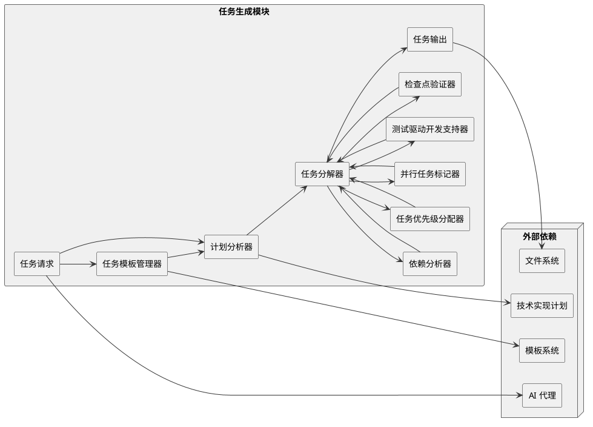

**数据流说明**：
1. AI 代理发起任务生成请求，指定技术实现计划
2. 任务模板管理器从模板系统中获取任务模板
3. 计划分析器分析技术实现计划，提取关键信息
4. 任务分解器将计划分解为具体的任务
5. 任务分解器调用各个子组件：
   - 依赖分析器：分析任务之间的依赖关系
   - 任务优先级分配器：为任务分配优先级
   - 并行任务标记器：标记可以并行执行的任务
   - 测试驱动开发支持器：生成支持测试驱动开发的任务结构
   - 检查点验证器：添加检查点验证任务
6. 各个子组件将结果返回给任务分解器
7. 任务分解器整合所有信息，生成最终的任务列表
8. 任务列表输出到文件系统

**关键流程**：
- 计划分析：分析技术实现计划，提取关键信息
- 任务分解：将计划分解为具体的任务
- 依赖分析：分析任务之间的依赖关系
- 优先级分配：为任务分配优先级
- 并行标记：标记可以并行执行的任务
- TDD支持：生成支持测试驱动开发的任务结构
- 检查点验证：添加检查点验证任务
- 任务输出：将生成的任务列表输出到文件系统

**任务结构**：
1. 用户故事标识
2. 任务描述
3. 任务优先级
4. 任务依赖关系
5. 并行执行标记
6. 文件路径
7. 测试驱动开发结构
8. 检查点验证

**任务类型**：
- 功能开发任务：实现具体的功能
- 测试开发任务：编写测试用例
- 文档编写任务：编写文档
- 检查点验证任务：验证阶段性成果
- 部署任务：部署应用程序

## 4. 模块间交互逻辑

### 4.1 项目初始化流程

**流程说明**：用户通过CLI工具初始化新项目，包括工具检查、AI代理选择、模板下载和提取、目录结构创建以及Git初始化等步骤。

**PlantUML 流程图**：

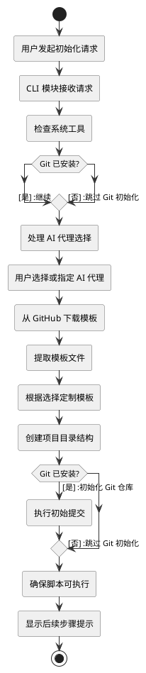

### 4.2 规范驱动开发流程

**流程说明**：用户通过AI代理使用/speckit.*命令完成规范驱动开发的整个流程，从创建项目原则到执行实现，包括可选的规范澄清、跨工件分析和质量检查等步骤。

**PlantUML 流程图**：

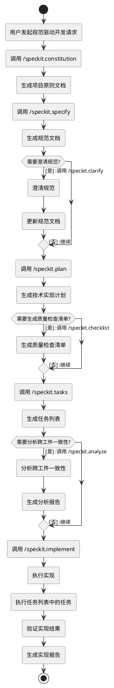

### 4.3 模板管理流程

**流程说明**：CLI模块通过模板管理模块从GitHub下载、提取和定制模板，然后应用到项目中，支持不同AI代理和脚本类型的模板定制。

**PlantUML 流程图**：

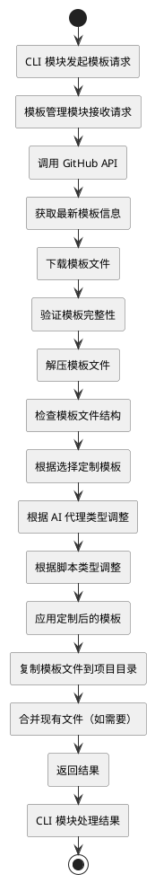

## 5. 用户视角的 Use Case

### 5.1 场景 1：初始化新项目

**用户目标**：创建一个新的规范驱动开发项目

**流程**：
1. 安装 specify-cli：`uv tool install specify-cli --from git+https://github.com/github/spec-kit.git`
2. 初始化项目：`specify init my-project --ai claude`
3. 进入项目目录：`cd my-project`
4. 启动 AI 代理

**预期结果**：
- 创建了一个新的项目目录
- 设置了规范驱动开发的目录结构
- 初始化了 Git 仓库
- AI 代理可以使用 /speckit.* 命令

### 5.2 场景 2：开发照片相册应用

**用户目标**：使用规范驱动开发创建一个照片相册应用

**流程**：
1. 建立项目原则：`/speckit.constitution Create principles focused on code quality, testing standards, user experience consistency, and performance requirements`
2. 创建规范：`/speckit.specify Build an application that can help me organize my photos in separate photo albums. Albums are grouped by date and can be re-organized by dragging and dropping on the main page. Albums are never in other nested albums. Within each album, photos are previewed in a tile-like interface.`
3. 生成技术计划：`/speckit.plan The application uses Vite with minimal number of libraries. Use vanilla HTML, CSS, and JavaScript as much as possible. Images are not uploaded anywhere and metadata is stored in a local SQLite database.`
4. 生成任务列表：`/speckit.tasks`
5. 执行实现：`/speckit.implement`

**预期结果**：
- 生成了完整的项目原则文档
- 创建了结构化的功能规范
- 生成了详细的技术实现计划
- 生成了可执行的任务列表
- 执行任务，生成了工作的照片相册应用

## 6. 4+1 视图总结

### 6.1 逻辑视图

**核心组件**：
- CLI 工具：处理命令行输入和输出
- 模板系统：管理模板的下载、提取和定制
- AI 代理集成：支持多种 AI 代理
- 工作流自动化：实现 /speckit.* 命令
- 规范生成：生成和管理规范文档
- 计划生成：生成技术实现计划
- 任务生成：生成可执行的任务列表

**组件关系**：
- CLI 工具作为入口，调用其他组件
- 模板系统为规范生成、计划生成和任务生成提供模板
- AI 代理集成模块支持不同 AI 代理
- 工作流自动化模块协调规范驱动开发流程

**PlantUML 组件图**：

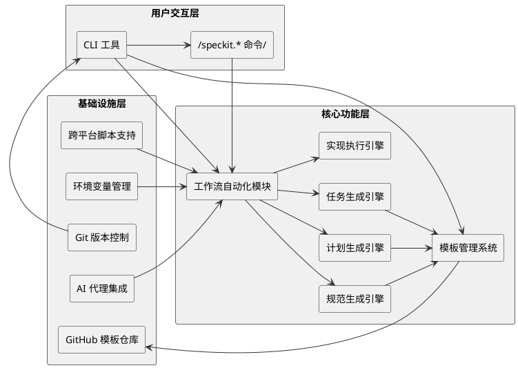

### 6.2 进程视图

**主要流程**：
1. **项目初始化流程**：检查工具 → 选择 AI 代理 → 下载模板 → 提取模板 → 初始化 Git 仓库
2. **规范生成流程**：接收用户输入 → 应用模板 → 生成规范文档 → 验证规范质量
3. **计划生成流程**：分析规范 → 选择技术栈 → 设计架构 → 生成支持文档
4. **任务生成流程**：分析计划 → 分解任务 → 分析依赖 → 生成任务列表
5. **实现执行流程**：解析任务列表 → 执行任务 → 验证结果 → 生成报告

**并行执行**：
- 模板下载和工具检查可以并行执行
- 不相关的任务可以并行执行（标记为 [P]）

**PlantUML 流程图**：

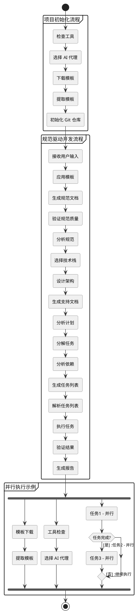

### 6.3 物理视图

**部署结构**：
- CLI 工具安装在用户本地环境
- 模板存储在 GitHub 仓库
- AI 代理运行在用户本地环境或云端
- 项目文件存储在用户本地文件系统

**依赖关系**：
- CLI 工具依赖 Python 3.11+
- 模板依赖 GitHub API
- AI 代理依赖各自的运行时环境

**PlantUML 部署图**：

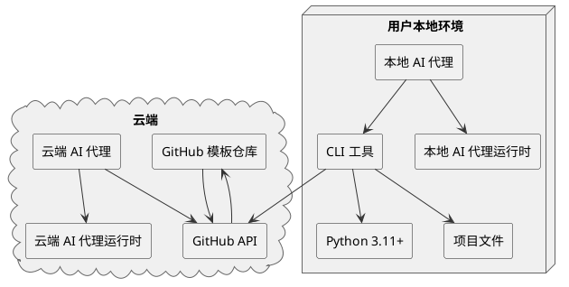

### 6.4 开发视图

**开发环境**：
- 开发语言：Python 3.11+
- 构建工具：uv
- 测试框架：未明确指定
- CI/CD：GitHub Actions

**代码组织**：
- 核心代码在 `src/specify_cli/` 目录
- 模板在 `templates/` 目录
- 脚本在 `scripts/` 目录
- 文档在 `docs/` 目录

**PlantUML 目录结构图**：

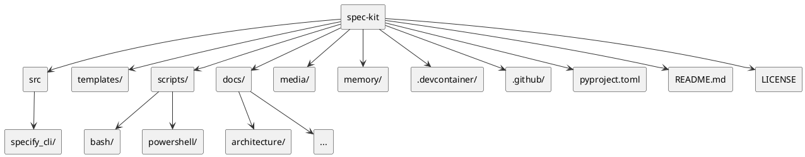

**开发流程**：
- 遵循规范驱动开发原则
- 使用 GitHub Flow 进行版本控制
- 通过 Pull Request 进行代码审查

### 6.5 场景视图

**典型场景**：
1. **新项目初始化**：用户使用 specify init 命令初始化新项目
2. **规范创建**：用户使用 /speckit.specify 命令创建功能规范
3. **计划生成**：用户使用 /speckit.plan 命令生成技术实现计划
4. **任务生成**：用户使用 /speckit.tasks 命令生成任务列表
5. **实现执行**：用户使用 /speckit.implement 命令执行任务
6. **规范澄清**：用户使用 /speckit.clarify 命令澄清规范
7. **质量分析**：用户使用 /speckit.analyze 命令分析跨工件一致性
8. **质量检查**：用户使用 /speckit.checklist 命令生成质量检查清单

**PlantUML 序列图**：

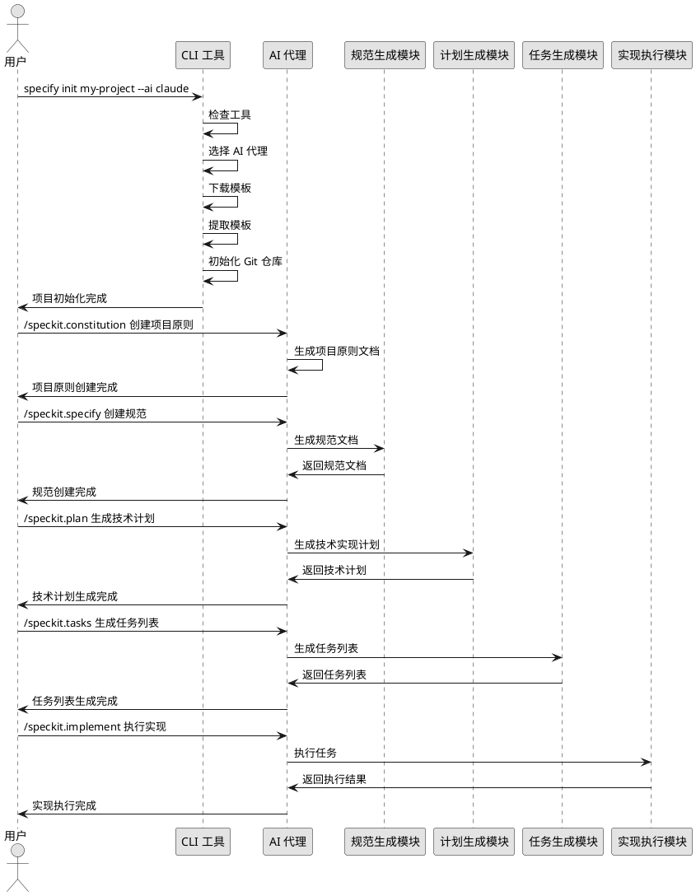

## 7. 技术栈与依赖

| 类别         | 技术/依赖      | 用途               |
| ------------ | -------------- | ------------------ |
| 开发语言     | Python 3.11+   | 核心开发语言       |
| CLI 框架     | Typer          | 构建 CLI 应用      |
| 富文本输出   | Rich           | 终端富文本输出     |
| HTTP 客户端  | httpx          | 从 GitHub 下载模板 |
| 跨平台目录   | platformdirs   | 处理跨平台目录     |
| 终端交互     | readchar       | 处理终端交互       |
| SSL/TLS 验证 | truststore     | 增强 SSL/TLS 验证  |
| 包管理       | uv             | Python 包管理      |
| 版本控制     | Git            | 代码版本控制       |
| CI/CD        | GitHub Actions | 持续集成和部署     |

## 8. 关键设计决策

### 8.1 使用实际 CLI 工具名称作为键

**决策**：在 AGENT_CONFIG 中使用实际可执行文件名称作为键

**原因**：
- `check_tool()` 函数使用 `shutil.which(tool)` 查找可执行文件
- 避免在整个代码库中使用特殊情况映射
- 减少复杂性和维护负担
- 工具检查"正常工作"，无需额外映射

### 8.2 模板驱动的质量控制

**决策**：使用结构化模板约束 AI 行为

**原因**：
- 防止过早引入实现细节
- 强制标记不确定性
- 通过清单实现结构化思考
- 强制执行架构原则
- 维护适当的抽象级别

### 8.3 宪法驱动的架构纪律

**决策**：引入"开发宪法"概念

**原因**：
- 确保生成的代码符合架构原则
- 维护代码质量和一致性
- 防止过度工程
- 确保生成的代码可测试、可维护

### 8.4 多 AI 代理支持

**决策**：支持多种 AI 代理

**原因**：
- 适应不同开发者的偏好
- 利用不同 AI 代理的优势
- 提高系统的灵活性和可扩展性
- 降低对单一 AI 代理的依赖

## 9. 未来发展方向

### 9.1 技术独立性

- 创建使用不同技术栈的应用
- 验证 SDD 是一个不依赖于特定技术的过程

### 9.2 企业约束

- 演示关键任务应用程序开发
- 纳入组织约束（云提供商、技术栈、工程实践）
- 支持企业设计系统和合规要求

### 9.3 以用户为中心的开发

- 为不同用户群体和偏好构建应用
- 支持各种开发方法（从 vibe-coding 到 AI 原生开发）

### 9.4 创造性和迭代过程

- 验证并行实现探索的概念
- 提供强大的迭代功能开发工作流
- 将流程扩展到处理升级和现代化任务

## 10. 结论

Spec Kit 是一个创新的规范驱动开发工具包，它颠覆了传统软件开发模式，将规范从脚手架转变为可执行的源文件。其核心优势包括：

1. **结构化的规范驱动开发流程**：从原则建立到实现执行的完整流程
2. **多 AI 代理支持**：兼容多种主流 AI 代理
3. **模板驱动的质量控制**：确保生成高质量的规范和实现
4. **宪法驱动的架构纪律**：确保生成的代码符合架构原则
5. **灵活的技术栈选择**：支持多种技术栈
6. **良好的扩展性**：支持从 0 到 1 的新项目开发，也支持现有项目的迭代增强

Spec Kit 代表了软件开发的一种新趋势，即利用 AI 能力将自然语言规范转化为可执行代码，从而提高开发效率和代码质量。对于希望采用规范驱动开发的团队和开发者来说，Spec Kit 是一个强大的工具。